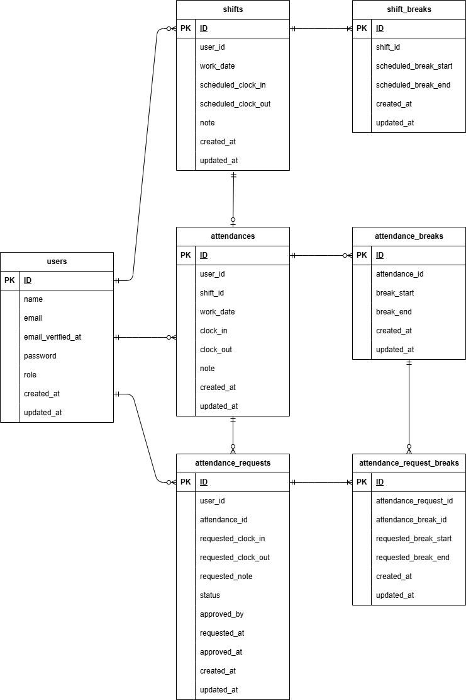

# coachtech勤怠管理アプリ

ユーザーの勤怠登録と管理ができるアプリです。

## 環境構築

#### リポジトリをクローン

```
git clone git@github.com:ikemi-yuki/attendance-management-app.git
```

#### Laravelのビルド

DockerDesktopアプリを立ち上げる

```
docker-compose up -d --build
```

#### Laravelパッケージのダウンロード

```
docker-compose exec php bash
```
```
composer install
```

#### .envファイルの作成

```
cp .env.example .env
```

#### .envファイルの修正

```
DB_HOST=mysql

DB_DATABASE=laravel_db

DB_USERNAME=laravel_user

DB_PASSWORD=laravel_pass
```

#### キー生成

```
php artisan key:generate
```

#### マイグレーション・シーディングを実行

```
php artisan migrate
```
```
php artisan db:seed
```

## メール認証

本アプリでは、メール送信にMailhogを使用しています。<br>
以下にアクセスすると送信されたメールを確認できます。<br>
http://localhost:8025

## テストアカウント

name: 一般ユーザー<br>
email: user@example.com<br>
password: password
-------------------------
name: 管理者<br>
email: admin@example.com<br>
password: password
-------------------------

## PHPUnitを利用したテスト

※ テストでは `demo_test` データベースを使用します。

#### .env.testing ファイルの作成

```
cp .env.testing.example .env.testing
```

#### .env.testing ファイルの修正

```
DB_PASSWORD=root
```

#### `demo_test` データベースの作成（ホスト側で実行）

```
docker-compose exec mysql bash
```
```
mysql -u root -p
```
```
CREATE DATABASE demo_test;
```
※ データベース作成時にエラーが出る場合は、
MySQLコンテナを再起動してください。

```
docker-compose restart mysql
```

#### キー生成・マイグレーション・テスト実行

```
php artisan key:generate --env=testing
```
```
php artisan migrate --env=testing
```
```
php artisan test
```

## 使用技術（実行環境）

フレームワーク: Laravel:8.83.29

言語：HTML CSS PHP

Webサーバー: Nginx:1.21.1

データベース: MySQL:8.0.26

## ER図



## URL

一般ユーザー用ログイン画面：http://localhost/login

管理者用ログイン画面：http://localhost/admin/login

phpMyAdmin：http://localhost:8080/